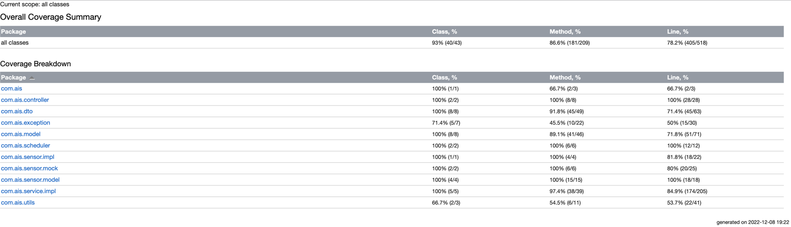

# automatic-irrigation-system
## Automatic Irrigation System

### Requirements:
1. Java 8
2. H2
3. IntelliJ

### Steps to configure the project:
1. Clone https://github.com/pravinmandge/automatic-irrigation-system.git
2. Import as maven project
3. run mvn clean Install -DskipTests or mvn clean Install command
run AutomaticIrrigationSystemApplication.java will start spring boot application on 8080 port
4. Open Swagger for Api documentation (http://localhost:8080/swagger-ui/index.html)

### Steps for automatic irrigation:
1. Create a plot. (http://localhost:8080/swagger-ui/index.html#/plot-controller/createPlot)
2. Configure the plot. (http://localhost:8080/swagger-ui/index.html#/plot-controller/configurePlot)
3. After this the slots will be automatically created for the plot and plot will automatically irrigate via schedulers.
4. Flyway migration added, which will create schema and tables along with some initial data.

### Schedulers
#### 1. IrrigationEventScheduler
   1. PENDING slots will be fetched and irrigated via sensor and marked as IN_PROGRESS
   2. after durationInMin for that slot, the slot will be marked as COMPLETED
   3. Plot Irrigation will be marked as IDLE
#### 2. SlotEventScheduler
   1. This is responsible for creating slots with PENDING status according configured plots and next execution time for that plot irrigation.
   2. Plot Irrigation will be marked as IN_PROGRESS

### Postman Collection
1. Postman collection is available to import in project "/Automatic Irrigation System.postman_collection.json"
2. Postman collection APIs has examples as well to create, configure and fetch Plots, fetch Slots by Plot id etc.

### Code Coverage Report

NOTE: Plot with Name-'My Plot 2 Fail' is set to always fail the irrigation and alert will be published